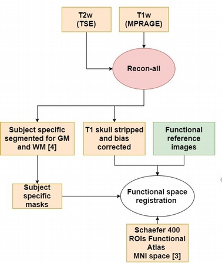
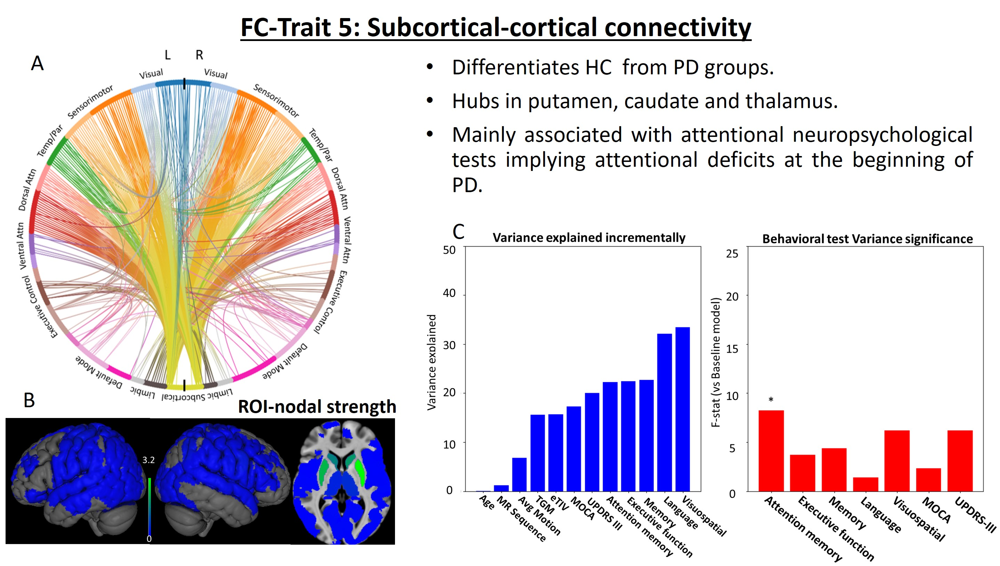
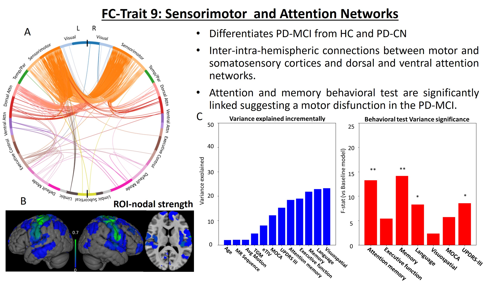

# [Introduction](#introduction)

Mild cognitive impairment (MCI), frequent in Parkinson Disease (PD), is a well-known risk factor for dementia. Nevertheless, MCI key network changes are still mostly unknown. Functional connectivity resting state networks (RSNs), such as the default mode, dorsal attention, executive control and sensorimotor networks, have been reported to correlated with cognitive deficits in PD. This study investigates how whole-brain functional networks are affected by MCI in PD using a Connectome ICA [^1] (connICA) analysis with resting state functional MRI (RS-fMRI).

# [Dataset](#dataset)

87 participants (26 PD-CN and 33 PD-MCI and 28 HC) were recruited and scanned in Siemens Trio 3T MR scanner with 32 channel head coils

{:width="100%"}
**Figure 1: Dataset structure. Motion based censoring was done after Functional preprocessing eliminating the subjects with more than 20% of censored volumes. After motion based censoring, 21 HC, 21 PD-CN and, 23 PD-MCI subjects remained.**
 
 A battery of neuropsychological tests was taken by each individual to diagnose PD-MCI according to MDS task force guidelines (level II) [^2]. We evaluated the cognitive state of each participant with a battery of two neuropsychological test for each cognitive domain:
- Attention: Inverse digit span memory test, Symbol digit modalities test
- Executive function: trail making test B, phonetic fluency
- Memory: Rey Auditory Verbal Learning Test (RAVLT), Rey–Osterrieth complex figure test (ROCF)
- Language: semantic fluency test, Boston naming test 
- Visuospatial:  Object decision and number location from the Visual Object and Space Perception Battery (VOSP)
PD patients were under anti-parkinsonian medication during the study.

# [Acquisition and Preprocessing](#preprocessing)

For each subject, we collected: T1-weighted and T2-weighted anatomical scans (1 mm isotropic voxels), and 10 minutes eyes-open resting state BOLD fMRI images with standard (monoband, TR=2s, 33 slices) and multiband (TR=800ms, 45 slices) GE-EPI images (3 mm isotropic voxels, matrix size= 64x64, TE= 28ms).

{:width="100%"}
**Figure 2: Anatomical Preprocessing.**

Brain parcellation was performed using FreeSurfer based on the Destrieux atlas (72 cortical and 8 subcortical regions for hemisphere)[^3]. Structural images were registered to the functional images.
fMRI preprocessing included despiking, slice timing, EPI distortion correction, head realignment and nuisance regression. After motion based censoring, 21 HC, 21 PD-CN and, 23 PD-MCI subjects remained.

{:width="100%"}
**Figure 3: Functional Preprocessing.**

fMRI preprocessing (AFNI) included despiking, slice timing, EPI distortion correction, head realignment, nuisance regression (6 Legendre polynomials, 6 realignment parameters plus temporal derivatives, 5 principal components of WM and ventricle CSF voxels and 5 PCs of brain’s edge voxels). After Motion based censoring, (Frame wise displacement(9)> 0.4), 21 HC, 21 PD-CN and, 23 PD-MCI subjects remained for further analysis.

# [ConnICA](#ConnICA)

FC matrices were computed using Schaefer atlas plus subcortical areas of Destrieux atlas[^3] [^4]. We used Principal Component Analysis (PCA) as a cleaning step, the number of components preserved was chosen by reconstructing the connectivity matrices and checking the identifiability of individual subjects in each reconstruction[^5]. The dimensionality reduction resulted in 65 components.

{:width="100%"}
**Figure 4. Criteria for dimensionality reduction based on the increase of the identifiability, in our case 65 components was the number of components selected by this criteria.**

Finally, we applied connICA [^1] with Melodic ICA on the functional connectomes using the dimensionality calculated in the cleaning step. This step allows to extract the common connectivity patterns between subjects FC matrices.

{:width="100%"}
**Figure 5: ConnICA Analysis.**

Linear mixed effect (LME) model on the weights of each FC-trait with group (HC, PD-CN, PD-MCI) with the sequence (monoband, multiband) as fixed factor, and subjects as random factor. Anova p-values are corrected (Bonferroni method). Incremental ANOVAs and individual F-tests were computed to evaluate the relationship between the FC-traits and neuropsychological assessments.

# [Results](#results)

{:width="100%"}
**Figure 6: Subcortical connectivity trait results. A) Circular plot B)  nodal strength brain maps of each ROI C) Left: Anova regressions incrementally adding first anthropometric measures and coginitve tests. Right: F-value obtanined by comparing the baseline model (only anthropometric measures) with a cognitive test or motor measure.**

FC-trait 5 has subcortical hubs in putamen, caudate and thalamus, highlighting a clear manifestation of the ganglia-thalamo-cortical alterations at the onset of PD. This FC-trait is mainly associated with attentional tests implying attentional deficits at the beginning of PD.
{:width="100%"}
**Figure 7: Sensorimotor and attention networks trait results. A) Circular plot B)  nodal strength brain maps of each ROI C) Left: Anova regressions incrementally adding first anthropometric measures and coginitve tests. Right: F-value obtanined by comparing the baseline model (only anthropometric measures) with a cognitive test or motor measure.**

FC-trait 9 mainly involves inter- and intra-hemispheric connections between regions of the primary and secondary motor and somatosensory cortices and dorsal and ventral attention networks.  Although UPDRS-III is link to this trait, attention and memory behavioral test are significantly linked suggesting a motor disfunction in the PD-MCI patients that is related to attentional and memory impairments.  The significance of language test could be an effect from the semantic fluency test.
{:width="100%"}
**Figure 8:Visual and fronto-parietal connections trait results. A) Circular plot B)  nodal strength brain maps of each ROI C) Left: Anova regressions incrementally adding first anthropometric measures and coginitve tests. Right: F-value obtanined by comparing the baseline model (only anthropometric measures) with a cognitive test or motor measure.**

Trait 13 that compromises Visual-parietal and visual-executive control connections differentiates HC from PD groups. Anova regressions associate it to UPDRS-III which suggest a connection to motor symptoms.
{:width="100%"}
**Figure 9: Angular gyrus temporal and attention trait results. A) Circular plot B)  nodal strength brain maps of each ROI C) Left: Anova regressions incrementally adding first anthropometric measures and coginitve tests. Right: F-value obtanined by comparing the baseline model (only anthropometric measures) with a cognitive test or motor measure.**

Trait 34 mainly shows the angular gyrus connecting to temporal, parietal and visual connections differentiates all three groups from each other. However, behavioral tests didn't correlate.

# [Take home](#take-home)

- Pronounced subcortico-cortical and visuo-cortical FC changes related to attentional and motor skills differentiated PD patients from healthy controls.
- Functional connections between attentional and sensorimotor regions are key for PD-MCI development, and are associated with deficits in attention and memory abilities.

---
[^1]: Amico E, Goñi J. Mapping hybrid functional-structural connectivity traits in the human connectome. Netw Neurosci 2018; 2: 306–322.
[^2]: Litvan I, Goldman JG, Tröster AI, Schmand BA, Weintraub D, Petersen RC, et al. Diagnostic criteria for mild cognitive impairment in Parkinson’s disease: Movement Disorder Society Task Force guidelines. Mov Disord 2012; 27: 349–56.
[^3]: Destrieux C, Fischl B, Dale A, Halgren E. Automatic parcellation of human cortical gyri and sulci using standard anatomical nomenclature. Neuroimage 2010; 53: 1–15.
[^4]: Schaefer A, Kong R, Gordon EM, Laumann TO, Zuo X-N, Holmes AJ, et al. Local-Global Parcellation of the Human Cerebral Cortex from Intrinsic Functional Connectivity MRI. Cereb Cortex 2018; 28: 3095–3114.
[^5]: Amico E, Goñi J. The quest for identifiability in human functional connectomes. Sci Rep 2018; 8: 8254.