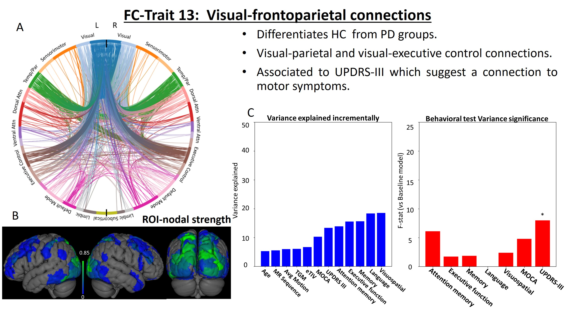

# [Introduction](#Introduction)

Mild cognitive impairment (MCI), frequent in Parkinson Disease (PD), is a well-known risk factor for dementia. Nevertheless, MCI key network changes are still mostly unknown. Functional connectivity resting state networks (RSNs), such as the default mode, dorsal attention, executive control and sensorimotor networks, have been reported to correlated with cognitive deficits in PD. This study investigates how whole-brain functional networks are affected by MCI in PD using a Connectome ICA (connICA) analysis with resting state functional MRI (RS-fMRI).

# [Dataset](#Dataset)
87 participants (26 PDCN and 33 PD-MCI and 28 HC) were recruited and scanned in Siemens Trio 3T MR scanner with 32 channel head coils. A battery of neuropsychological tests was taken by each individual to diagnose PD-MCI according to MDS task force guidelines (level II) [^1]. PD patients were under anti-parkinsonian medication during the study
{:width="100%"}
**Figure 1: Dataset structure. Motion based censoring was done after Functional preprocessing eliminating the subjects with more than 20% of censored volumes. After motion based censoring, 21 HC, 21 PDCN and, 23 PD-MCI subjects remained**

# [Acqusition and Preprocesing](#Preprocesing)
For each subject, we collected: T1-weighted and T2-weighted anatomical scans (1 mm isotropic voxels), and 10 minutes eyes-open resting state BOLD fMRI images with standard (monoband, TR=2s, 33 slices) and multiband (TR=800ms, 45 slices) GE-EPI images (3 mm isotropic voxels, matrix size= 64x64, TE= 28ms). 
{:width="100%"}
**Figure 2: Anatomical Preprocessing**

Brain parcellation was performed using FreeSurfer based on the Destrieux atlas (72 cortical and 8 subcortical regions for hemisphere)[^2]. Structural images were registered to the functional images.
fMRI preprocessing included despiking, slice timing, EPI distortion correction, head realignment and nuisance regression. After motion based censoring, 21 HC, 21 PDCN and, 23 PD-MCI subjects remained. FC matrices were computed using Schaefer atlas plus subcortical areas of Destrieux atlas.
{:width="100%"}
**Figure 2: Functional preprocessing Preprocessing**
fMRI preprocessing (AFNI) included despiking, slice timing, EPI distortion correction, head realignment, nuisance regression (6 Legendre polynomials, 6 realignment parameters plus temporal derivatives, 5 principal components of WM and ventricle CSF voxels and 5 PCs of brain’s edge voxels). After Motion based censoring, (Frame wise displacement(9)> 0.4), 21 HC, 21 PDCN and, 23 PD-MCI subjects remained for further analysis.

# [ConnICA](#ConnICA)
FC matrices were computed using Schaefer atlas plus subcortical areas of Destrieux atlas [^3] [^4] and then inputed to ConnICA [^5] using MELODIC with 65 independent FC-traits, which was the optimal PCA component for subject identifiability [^6]. 
{:width="100%"}
**Figure 2: ConnICA Analysis**
Linear mixed effect (LME) model on the weights of each FC-trait with group (HC, PDCN, PD-MCI) with the sequence (monoband, multiband) as fixed factor, and subjects as random factor. Anova p-values are corrected (Bonferroni method). Incremental ANOVAs and individual F-tests were computed to evaluate the relationship between the FC-traits and neuropsychological assessments.
# [Results](#Results)
{:width="100%"}
**Figure 3: FC-trait 5 has subcortical hubs in putamen, caudate and thalamus, highlighting a clear manifestation of the ganglia-thalamo-cortical alterations [8] at the onset of PD. This FC-trait is mainly associated with attentional tests implying attentional deficits at the beginning of PD.**
{:width="100%"}
**Figure 4: FC-trait 9 mainly involves inter- and intra-hemispheric connections between regions of the primary and secondary motor and somatosensory cortices and dorsal and ventral attention networks.  Although UPDRS-III is link to this trait, attention and memory behavioral test are significantly linked suggesting a motor disfunction in the PD-MCI patients that is related to attentional and memory impairments.  The significance of language test could be an effect from the semantic fluency test.**
{:width="100%"}
**Figure 5: Trait 13 that compromises Visual-parietal and visual-executive control connections differentiates HC from PD groups. Anova regressions associate it to UPDRS-III which suggest a connection to motor symptoms.**
{:width="100%"}
**Figure 6: Trait 34 mainly shows the angular gyrus connecting to temporal, parietal and visual connections differentiates all three groups from each other. No behavioral links**
---
[^1]: Litvan I, Goldman JG, Tröster AI, Schmand BA, Weintraub D, Petersen RC, et al. Diagnostic criteria for mild cognitive impairment in Parkinson’s disease: Movement Disorder Society Task Force guidelines. Mov Disord 2012; 27: 349–56.
[^2]:
[^3]:
[^4]:
[^5]:
[^6]: